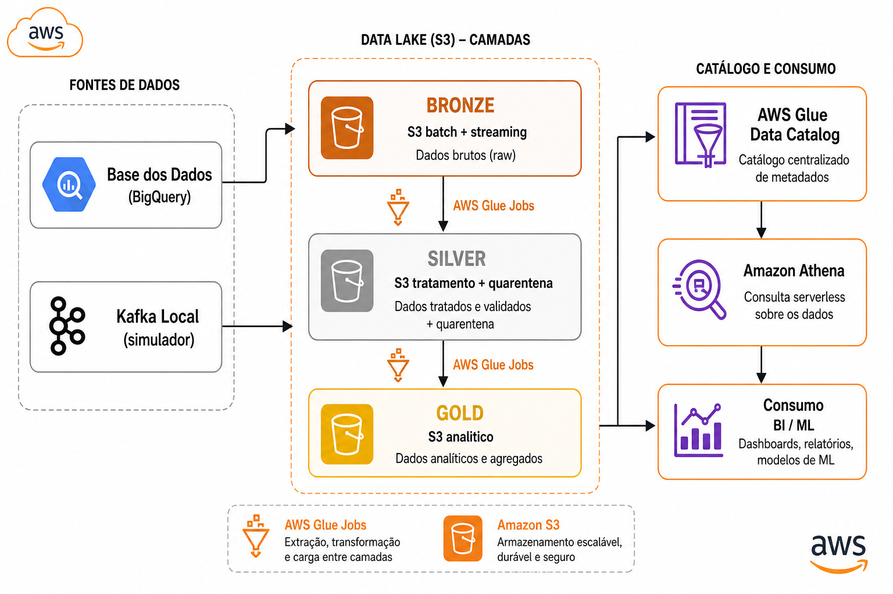

# Pipeline Híbrida — Indicador Criança Alfabetizada

**Tech Challenge — Fase 2 | Pós Tech em AI Scientist (FIAP/POSTECH)**

Pipeline de dados híbrida (batch + streaming) para integrar fontes educacionais do **Indicador Criança Alfabetizada (ICA)**. A solução utiliza a [Base dos Dados](https://basedosdados.org/) como fonte primária, segue a arquitetura **Medalhão** (Bronze → Silver → Gold) e está implantada na **Amazon Web Services**.

---

## 1. Contexto do problema

A alfabetização na infância é um dos pilares do desenvolvimento educacional brasileiro. O **Compromisso Nacional Criança Alfabetizada** mobiliza União, estados e municípios para garantir que todas as crianças estejam alfabetizadas ao final do 2º ano do ensino fundamental até **2030**.

Com base na Pesquisa Alfabetiza Brasil (2023), o Inep definiu o ponto de corte de **743 pontos** na escala de proficiência do Saeb como referência nacional de alfabetização. O ICA expressa o percentual de estudantes que atingem esse patamar, subsidiando políticas públicas baseadas em evidências.

---

## 2. Desafio educacional

O indicador permite responder perguntas como:

- Quais municípios estão **abaixo da meta** de alfabetização?
- Como evolui o percentual de alunos alfabetizados ao longo dos anos?
- Há **desigualdades regionais** entre UFs e municípios?
- As metas definidas (Brasil, UF, município) estão alinhadas com os resultados observados?

A camada Gold materializa essas análises em três visões consultáveis via Athena, prontas para dashboards, relatórios e modelos de IA.

---

## 3. Arquitetura proposta

A arquitetura é **híbrida**: ingestão **batch** para dados históricos da Base dos Dados e **streaming** (Kafka local) para simular atualizações em tempo quase real. O processamento ocorre na AWS com organização **Medalhão**:

| Camada | Bucket | Finalidade |
|--------|--------|------------|
| Bronze | `BUCKET_BRONZE` | Dados brutos (batch + streaming) |
| Silver | `BUCKET_SILVER` | Dados tratados, validados e integrados |
| Gold | `BUCKET_GOLD` | Visões analíticas para consumo |

Detalhes técnicos: [docs/arquitetura.md](docs/arquitetura.md) | [docs/decisoes-arquiteturais.md](docs/decisoes-arquiteturais.md)

---

## 4. Diagrama da pipeline



O diagrama mostra o fluxo completo: Base dos Dados e Kafka → Bronze → Glue (Silver/Gold) → Glue Data Catalog → Athena.

---

## 5. Fluxo de dados

### Batch (Base dos Dados → Bronze)

1. Extração via SDK `basedosdados` (BigQuery) com SELECT explícito
2. Staging local em Parquet (`data/staging/`)
3. Job Glue `etl-bronze-batch` grava em `s3://{BUCKET_BRONZE}/bronze/batch/{entidade}/`
4. Crawlers e DDL registram tabelas no Glue Catalog / Athena

### Streaming (Kafka → Bronze)

1. Simulador publica eventos no tópico `educacao.indicador_alfabetizacao`
2. Consumidor persiste em `s3://{BUCKET_BRONZE}/bronze/streaming/`
3. Integração na Silver com deduplicação por `event_id`

### Processamento (Silver → Gold)

1. Jobs Glue aplicam regras de qualidade, normalização e joins territoriais
2. Registros inválidos vão para `quarentena/`
3. Jobs Gold geram `gold_indicador_municipio`, `gold_meta_vs_resultado` e `gold_evolucao_temporal`

---

## 6. Tecnologias utilizadas

| Tecnologia | Papel | Justificativa |
|------------|-------|---------------|
| Base dos Dados (BigQuery) | Fonte oficial INEP | Dados educacionais padronizados e documentados |
| Python 3.12 | Orquestração e ETL | Ecossistema data engineering maduro |
| Apache Kafka (Docker) | Streaming simulado | Baixo custo em dev; padrão de mercado para eventos |
| Amazon S3 | Data Lake | Armazenamento escalável, Parquet colunar |
| AWS Glue (PySpark) | ETL distribuído | Serverless, integrado ao catálogo |
| AWS Glue Data Catalog | Metadados | Descoberta de schema e governança |
| Amazon Athena | Consultas SQL | Pay-per-scan, ideal para analytics ad hoc |
| AWS IAM | Segurança | Least privilege; usuário viewer somente leitura |
| Parquet + SNAPPY | Formato de arquivo | Reduz storage e scan (FinOps) |

---

## 7. Decisões arquiteturais

| Decisão | Alternativa considerada | Escolha | Motivo |
|---------|------------------------|---------|--------|
| Batch + streaming | Apenas batch | Híbrida | Atende requisito do challenge; streaming simula atualizações |
| Lake (S3) vs warehouse | Redshift | S3 + Athena | Custo menor em dev; flexibilidade de schema |
| Modelo Gold wide | Star schema | 3 tabelas wide | Simplicidade para Athena e features de ML |
| Kafka local vs MSK | Amazon MSK | Kafka Docker | ~$0 vs ~$150/mês em dev |
| Glue G.1X, 2 workers | G.2X | G.1X | Right-sizing; custo ~50% menor |
| Deduplicação alunos | Por `id_aluno` | `id_aluno + ano` | Evita subcontagem na Gold |

Mais detalhes: [docs/decisoes-arquiteturais.md](docs/decisoes-arquiteturais.md)

---

## 8. Monitoramento

- **Logs estruturados** nos jobs Glue (`src/common/logging.py`) com contexto de job, entidade e camada
- **CloudWatch** — métricas e logs dos jobs Glue (duração, falhas, DPU-hours)
- **Validação automatizada** — `validar_pipeline.py` com 51 checks (existência S3, schema, DQ, Gold)
- **Quarentena DQ** — registros rejeitados isolados em `silver/quarentena/` para auditoria

Não foi implantada stack opcional (Datadog, Grafana) para manter custo de dev baixo.

---

## 9. FinOps

Resumo das otimizações:

- Parquet + SNAPPY em todas as camadas (~80% economia vs CSV)
- Particionamento `ano/mes/dia` para reduzir scan no Athena
- Glue G.1X com 2 workers; upgrade só se SLA for violado
- Tags S3 (`project`, `layer`, `environment`, `finops`) para Cost Explorer
- Estimativa mensal em dev: **~$15–20/mês**

Documentação completa: [docs/finops.md](docs/finops.md)

---

## 10. Aplicação em IA

As visões Gold fornecem features prontas para modelos de machine learning e análises avançadas:

### Predição de alfabetização por município

Features: `pct_alfabetizados`, `gap_meta`, `meta_pct`, `indicador_uf`, evolução temporal (`gold_evolucao_temporal`). Modelos de regressão ou classificação podem prever municípios em risco de não atingir a meta 2030.

### Análise de desigualdade

Ranking por `gap_meta`, clusters por região/UF, comparação entre municípios com perfis similares. A visão `gold_meta_vs_resultado` cruza metas declaradas com resultados observados.

### Políticas públicas baseadas em dados

Query de municípios abaixo da meta para priorização de investimento:

```sql
SELECT nome, sigla_uf, ano, pct_alfabetizados, meta_pct, gap_meta
FROM datalake_alfabetizacao.gold_indicador_municipio
WHERE atingiu_meta = false
ORDER BY gap_meta ASC
LIMIT 20;
```

---

## 11. Estrutura do repositório

```
pipeline-alfabetizacao/
├── src/
│   ├── common/       # Configuração e logging
│   ├── batch/        # Extração Base dos Dados
│   ├── streaming/    # Produtor e consumidor Kafka
│   ├── bronze/       # Jobs Glue — ingestão
│   ├── silver/       # Transformação e DQ
│   ├── gold/         # Agregações analíticas
│   └── dq/           # Regras de qualidade
├── sql/athena/       # DDL e consultas analíticas
├── infra/aws/        # Artefatos IAM e infra
├── docker/           # Kafka local
├── docs/             # Arquitetura, FinOps, deploy, diagrama
├── scripts/          # Provisionamento, deploy, validação
└── tests/validation/ # Testes E2E por fase
```

---

## 12. Como executar

### Pré-requisitos

- Python 3.10+
- Conta AWS (S3, Glue, Athena, IAM)
- Projeto GCP com BigQuery (Base dos Dados)
- Docker Desktop (Kafka local)

### Setup

```powershell
cd pipeline-alfabetizacao
python -m venv .venv
.venv\Scripts\activate
pip install -r requirements.txt
copy .env.example .env
# Preencher credenciais AWS e BILLING_PROJECT_ID
```

### Infraestrutura AWS

```powershell
python scripts/provisionar_buckets.py
python scripts/provisionar_iam_glue.py
python scripts/registrar_tabelas_bronze_athena.py
```

### Pipeline local (batch)

```powershell
python scripts/explorar_basedosdados.py      # opcional — descoberta
python scripts/extrair_batch.py              # extração → staging
python scripts/carregar_bronze_batch.py      # staging → S3 Bronze
```

### Streaming (Kafka)

```powershell
.\scripts\subir_kafka_local.ps1
python -m src.streaming.produtor
python -m src.streaming.consumidor
```

### Silver e Gold

```powershell
python scripts/executar_silver_local.py
python scripts/executar_gold_local.py
python scripts/registrar_tabelas_gold_athena.py
```

### Deploy AWS (jobs Glue)

```powershell
python scripts/deploy_aws.py
# ou passo a passo: publicar_glue_aws.py → provisionar_jobs_glue.py → executar_pipeline_aws.py
```

Documentação de deploy: [docs/deploy-aws.md](docs/deploy-aws.md)

### Usuário viewer (somente leitura)

```powershell
python scripts/provisionar_usuario_viewer.py
# Credenciais em .env.viewer (não versionado)
```

---

## 13. Validação

### Validação end-to-end (51 checks)

```powershell
python tests/validation/validar_pipeline.py
```

Verifica: buckets S3, partições, schemas Bronze/Silver/Gold, regras DQ, consistência analítica.

### Testes automatizados (pytest)

```powershell
python -m pytest tests/validation/ -q
```

Inclui testes por fase (04–09) e validação AWS Glue quando credenciais estão configuradas.

---

## 14. Equipe e vídeo

| Membro | Papel |
|--------|-------|
| Jonathan Relva | Desenvolvimento completo da pipeline, documentação e deploy |

**Vídeo executivo (≤ 5 min):** _link a ser adicionado após gravação_

O vídeo cobre: problema de negócio, arquitetura híbrida, demonstração Athena, valor analítico, aplicação em IA e FinOps.

---

## Documentação complementar

| Documento | Conteúdo |
|-----------|----------|
| [Arquitetura](docs/arquitetura.md) | Fluxo detalhado e componentes AWS |
| [FinOps](docs/finops.md) | Otimizações e estimativa de custos |
| [Deploy AWS](docs/deploy-aws.md) | Jobs Glue e execução na nuvem |
| [Decisões arquiteturais](docs/decisoes-arquiteturais.md) | Trade-offs documentados |
| [Git workflow](docs/git-workflow.md) | Branches, commits e PRs |
| [Regras de qualidade](docs/regras-qualidade.md) | Regras DQ da Silver |

---

## Referências

- [Base dos Dados](https://basedosdados.org/)
- [Compromisso Nacional Criança Alfabetizada](https://www.gov.br/mec/pt-br/crianca-alfabetizada)
- [Tech Challenge — Fase 2](../[IAST]%20-%20Tech%20Challenge%20-%20Fase%202.pdf)
