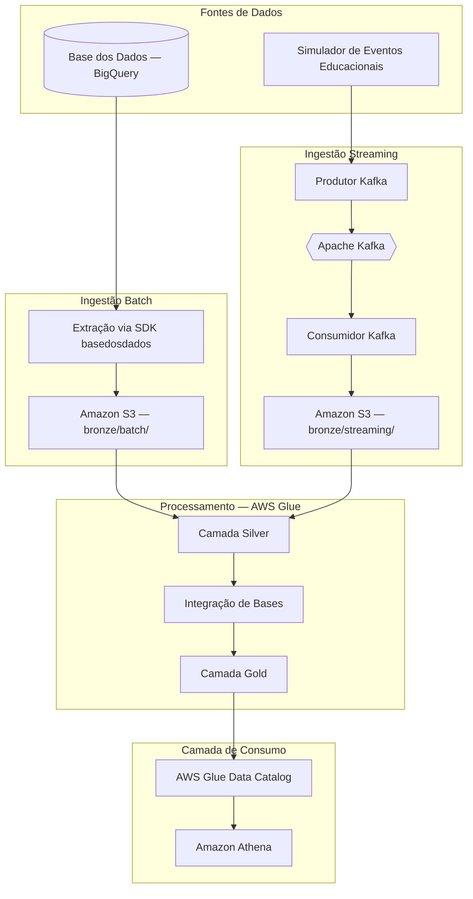

# Arquitetura da Solução

## 1. Introdução

Este documento descreve a arquitetura da pipeline de dados desenvolvida para o Tech Challenge da Fase 2 do curso Pós Tech em AI Scientist. O projeto tem como objetivo integrar fontes educacionais relacionadas ao **Indicador Criança Alfabetizada (ICA)**, permitindo análises sobre alfabetização infantil no Brasil.

O **Compromisso Nacional Criança Alfabetizada** estabelece que todas as crianças devem estar alfabetizadas ao final do 2º ano do ensino fundamental até 2030. Com base na Pesquisa Alfabetiza Brasil (2023), o Instituto Nacional de Estudos e Pesquisas Educacionais Anísio Teixeira (Inep) definiu o ponto de corte de **743 pontos** na escala de proficiência do Saeb como referência nacional de alfabetização.

A solução proposta integra metas nacionais, estaduais e municipais, dados territoriais e microdados de alunos, viabilizando análises sobre desigualdades educacionais e o cumprimento de metas públicas.

## 2. Visão geral da arquitetura

A arquitetura adotada é **híbrida**, combinando ingestão **batch** para dados históricos e **streaming** para simulação de atualizações em tempo quase real. O processamento é realizado em nuvem (**AWS**), com organização dos dados segundo o padrão **Medalhão**.

| Camada | Bucket | Finalidade |
|--------|--------|------------|
| Bronze | `BUCKET_BRONZE` | Preservação dos dados brutos ingeridos |
| Silver | `BUCKET_SILVER` | Dados tratados, validados e integrados |
| Gold | `BUCKET_GOLD` | Dados analíticos prontos para consumo |

## 3. Diagrama da pipeline



## 4. Fluxo de dados

### 4.1 Ingestão batch

A ingestão batch é responsável pela carga de dados históricos provenientes da plataforma Base dos Dados. O fluxo compreende as seguintes etapas:

1. Consulta às tabelas educacionais via SDK `basedosdados` (BigQuery);
2. Persistência temporária em formato Parquet;
3. Execução do job AWS Glue de ingestão na camada Bronze;
4. Aplicação de transformações, validações e integração na camada Silver;
5. Geração de visões analíticas na camada Gold.

### 4.2 Ingestão streaming

A ingestão streaming simula a chegada de eventos educacionais em tempo quase real, como atualizações de indicadores, revisões de metas e novas medições de desempenho. O fluxo compreende:

1. Publicação de eventos no tópico Kafka `educacao.indicador_alfabetizacao`;
2. Consumo e persistência dos eventos na camada Bronze (path `streaming/`);
3. Integração com os dados batch na camada Silver, com deduplicação por `event_id`.

## 5. Organização do armazenamento (Amazon S3)

Os dados são organizados em paths particionados por data (`ano`, `mes`, `dia`), conforme a estrutura abaixo:

```
s3://{BUCKET_BRONZE}/bronze/batch/{entidade}/ano={ano}/mes={mes}/dia={dia}/
s3://{BUCKET_BRONZE}/bronze/streaming/{entidade}/ano={ano}/mes={mes}/dia={dia}/
s3://{BUCKET_SILVER}/silver/{entidade}/ano={ano}/mes={mes}/dia={dia}/
s3://{BUCKET_SILVER}/quarentena/{entidade}/ano={ano}/mes={mes}/dia={dia}/
s3://{BUCKET_GOLD}/gold/{visao}/ano={ano}/mes={mes}/dia={dia}/
```

O formato de armazenamento adotado é **Apache Parquet** com compressão **SNAPPY**, visando redução de custos de armazenamento e otimização de consultas analíticas.

## 6. Entidades integradas

| Entidade | Fonte | Tipo de ingestão |
|----------|-------|------------------|
| Unidades Federativas (UF) | Base dos Dados | Batch |
| Municípios | Base dos Dados | Batch |
| Meta de alfabetização — Brasil | Base dos Dados | Batch |
| Meta de alfabetização — UF | Base dos Dados | Batch |
| Meta de alfabetização — Município | Base dos Dados | Batch |
| Microdados de alunos | Base dos Dados | Batch |
| Atualizações de indicador | Apache Kafka (simulado) | Streaming |

## 7. Componentes da infraestrutura AWS

| Serviço | Função na solução |
|---------|-------------------|
| Amazon S3 | Data Lake — armazenamento das camadas Bronze, Silver e Gold |
| AWS Glue Jobs | Processamento distribuído com PySpark |
| AWS Glue Data Catalog | Catálogo de metadados e schemas |
| AWS Glue Crawlers | Descoberta automática de schema na camada Bronze |
| Amazon Athena | Consultas SQL sobre os dados persistidos |
| AWS IAM | Controle de acesso e permissões dos serviços |
| Amazon CloudWatch | Monitoramento e logs operacionais dos jobs |

## 8. Camada analítica (Gold)

A camada Gold disponibiliza três visões analíticas principais:

1. **Indicador de alfabetização por município** — percentual de alunos alfabetizados em cada município;
2. **Comparação entre metas e resultados** — análise do gap entre o indicador observado e a meta estabelecida;
3. **Evolução temporal do indicador** — variação do indicador ao longo dos anos disponíveis.

Essas visões subsidiam dashboards, análises estatísticas e potenciais modelos de aprendizado de máquina para predição de alfabetização e identificação de desigualdades educacionais.
