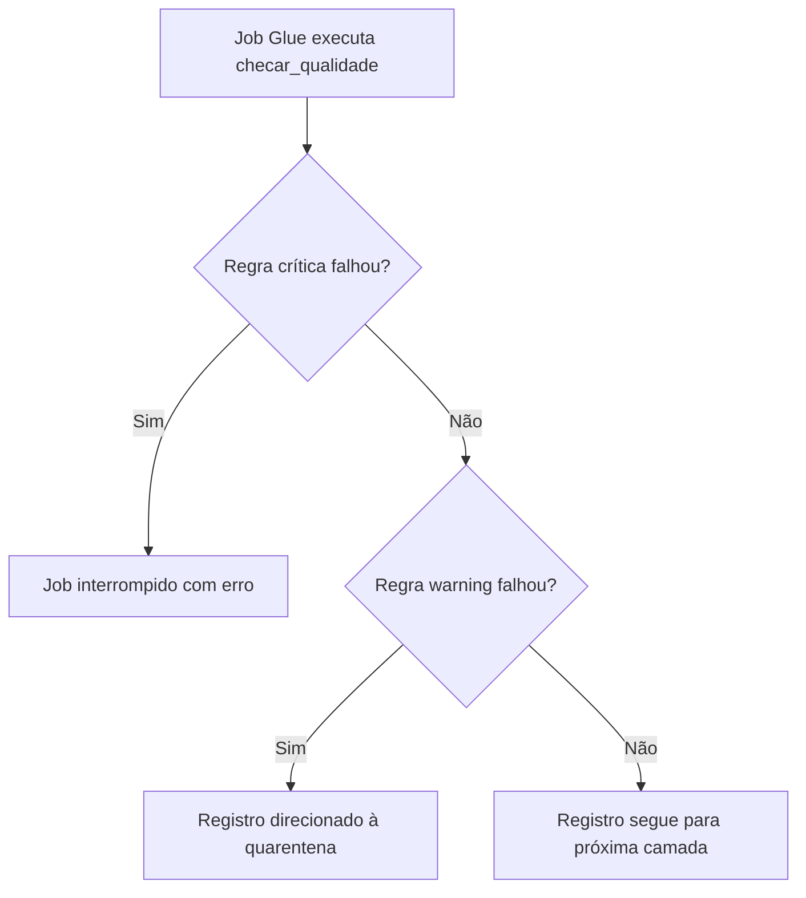

# Regras de Qualidade de Dados

## 1. Introdução

Este documento formaliza as regras de qualidade de dados (DQ) aplicadas na pipeline do Indicador Criança Alfabetizada. As verificações seguem o padrão `CHECKS` adotado nas aulas de ETL do curso e estão implementadas em `src/dq/checks.py`.

## 2. Dimensões de qualidade

A avaliação organiza-se em quatro dimensões, conforme o framework do curso:

| Dimensão | Definição | Exemplos na pipeline |
|----------|-----------|----------------------|
| **Completude** | Presença dos valores esperados | `not_null` em `id_municipio`, `ano`, `id_aluno` |
| **Validade** | Conformidade com domínio e formato | `regex` em códigos IBGE; `range` em percentuais |
| **Consistência** | Coerência entre atributos relacionados | `gap_meta` coerente com taxa e meta do ano |
| **Unicidade** | Ausência de duplicatas indevidas | `unique` em `id_municipio` (diretório) e `sigla_uf` |

## 3. Classificação das regras

Cada regra no dicionário `CHECKS` possui o atributo `critico`:

| Classificação | Comportamento |
|---------------|---------------|
| `critico: True` | Falha interrompe o job Glue correspondente |
| `critico: False` | Falha gera alerta (warning); registro pode seguir para quarentena |

## 4. Regras por entidade

### 4.1 UF (diretório)

| Camada | Regra | Tipo | Crítico |
|--------|-------|------|---------|
| Bronze | `sigla` não nula | not_null | Sim |
| Bronze | `sigla` única | unique | Sim |
| Bronze | `sigla` com 2 letras maiúsculas | regex | Sim |
| Silver | `sigla_uf` padronizada | not_null, unique, regex | Sim |

### 4.2 Município (diretório)

| Camada | Regra | Tipo | Crítico |
|--------|-------|------|---------|
| Bronze | `id_municipio` com 7 dígitos | regex | Sim |
| Bronze | `sigla_uf` presente | not_null | Sim |
| Silver | `id_municipio` único | unique | Sim |

### 4.3 Metas (`meta_brasil`, `meta_uf`, `meta_municipio`)

| Camada | Regra | Tipo | Crítico |
|--------|-------|------|---------|
| Bronze/Silver | `ano` ≥ 2023 | range | Sim |
| Bronze/Silver | Percentuais entre 0 e 100 | range | Sim |
| Silver | `taxa_alfabetizacao` pode ser nula em municípios sem dados | not_null | Não |
| Gold | KPIs (`taxa_alfabetizacao`, `meta_vigente`) presentes | not_null | Sim |

### 4.4 Alunos

| Camada | Regra | Tipo | Crítico |
|--------|-------|------|---------|
| Bronze | `id_aluno` e `id_municipio` obrigatórios | not_null | Sim |
| Silver | `proficiencia` entre 0 e 1000 | range | Não |
| Gold | Agregados municipais calculados | min_count, not_null | Sim |

## 5. Fluxo de tratamento de falhas



Registros em quarentena são persistidos em `s3://{BUCKET_SILVER}/quarentena/{entidade}/` com motivo documentado, sem interromper o processamento de registros válidos.

## 6. Integração nos jobs

```python
from src.dq.checks import checar_qualidade, get_checks

checks = get_checks("meta_municipio", "silver")
checar_qualidade(df_silver, checks)
```

Os schemas explícitos (`src/dq/schemas.py`) complementam as regras, impedindo inferência automática de tipos que poderia mascarar violações de validade.

## 7. Referência

As regras derivam do relatório de descoberta (`02-DISCOVERY.md`) e do dicionário de dados validado. Qualquer alteração de schema na origem exige revisão deste documento e do módulo `CHECKS`.
