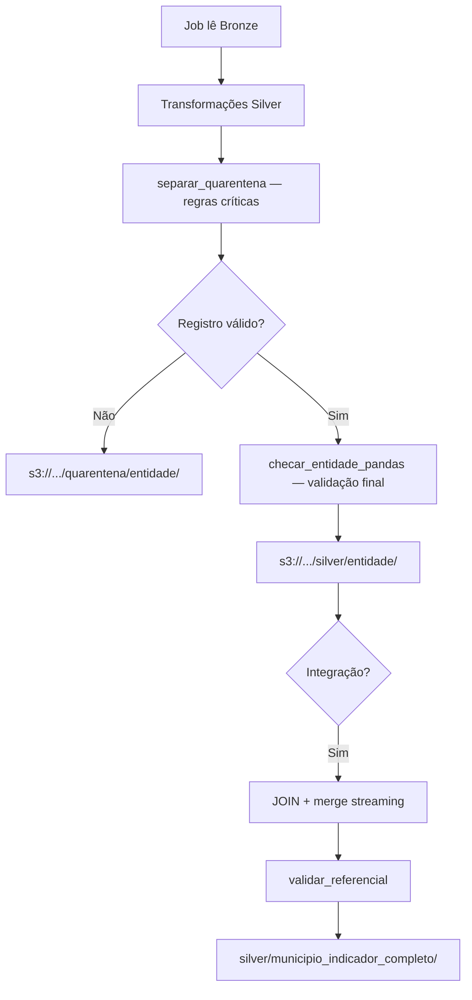

# Regras de Qualidade de Dados

## 1. Introdução

Este documento formaliza as regras de qualidade de dados (DQ) aplicadas na pipeline do Indicador Criança Alfabetizada. As verificações seguem o padrão `CHECKS` adotado nas aulas de ETL do curso e estão implementadas em `src/dq/checks.py`.

**Execução local (Windows):** as mesmas regras são aplicadas via `src/dq/checks_pandas.py`, usado pelos scripts `carregar_bronze_batch.py`, `carregar_bronze_streaming.py` e `carregar_silver.py`.

## 2. Dimensões de qualidade

A avaliação organiza-se em quatro dimensões, conforme o framework do curso:

| Dimensão | Definição | Exemplos na pipeline |
|----------|-----------|----------------------|
| **Completude** | Presença dos valores esperados | `not_null` em `id_municipio`, `ano`, `id_aluno` |
| **Validade** | Conformidade com domínio e formato | `regex` em códigos IBGE; `range` em percentuais |
| **Consistência** | Coerência entre atributos relacionados | `gap_meta` coerente com taxa e meta do ano; UF da meta = UF do município |
| **Unicidade** | Ausência de duplicatas indevidas | `unique` em `id_municipio` (diretório), `id_aluno` e `event_id` |

## 3. Classificação das regras

Cada regra no dicionário `CHECKS` possui o atributo `critico`:

| Classificação | Comportamento (Glue) | Comportamento (Silver local) |
|---------------|----------------------|------------------------------|
| `critico: True` | Job interrompido com erro | Registro segregado em **quarentena** |
| `critico: False` | Warning no log | Registro permanece na Silver (pode ser nulo) |

## 4. Regras por entidade

### 4.1 UF (diretório)

| Camada | Regra | Tipo | Crítico |
|--------|-------|------|---------|
| Bronze | `sigla` não nula | not_null | Sim |
| Bronze | `sigla` única | unique | Sim |
| Bronze | `sigla` com 2 letras maiúsculas | regex | Sim |
| Silver | `sigla_uf` padronizada | not_null, unique, regex | Sim |

**Transformações Silver:** `sigla` → `sigla_uf` (maiúsculas), `nome` → `nome_uf` (Title Case), deduplicação por `sigla_uf`.

### 4.2 Município (diretório)

| Camada | Regra | Tipo | Crítico |
|--------|-------|------|---------|
| Bronze | `id_municipio` com 7 dígitos | regex | Sim |
| Bronze | `sigla_uf` presente | not_null | Sim |
| Silver | `id_municipio` único | unique | Sim |

**Transformações Silver:** `id_municipio` normalizado com `zfill(7)`, `nome` → `nome_municipio`, deduplicação por `id_municipio`.

### 4.3 Metas (`meta_brasil`, `meta_uf`, `meta_municipio`)

| Camada | Regra | Tipo | Crítico |
|--------|-------|------|---------|
| Bronze/Silver | `ano` ≥ 2023 | range | Sim |
| Bronze/Silver | Percentuais entre 0 e 100 | range | Sim |
| Silver | `taxa_alfabetizacao` pode ser nula em municípios sem dados | not_null | Não |
| Silver | `gap_meta` e `atingiu_meta` calculados (meta_municipio) | derivado | — |
| Gold | KPIs (`taxa_alfabetizacao`, `meta_vigente`) presentes | not_null | Sim |

**Transformações Silver (meta_municipio):**

- Enriquecimento com `sigla_uf` via join com o diretório de municípios
- `gap_meta = taxa_alfabetizacao - meta_vigente` (meta do ano ou fallback 2030)
- `atingiu_meta = taxa_alfabetizacao >= meta_vigente`
- Deduplicação por `id_municipio + ano + rede`

### 4.4 Alunos

| Camada | Regra | Tipo | Crítico |
|--------|-------|------|---------|
| Bronze | `id_aluno` e `id_municipio` obrigatórios | not_null | Sim |
| Silver | `proficiencia` entre 0 e 1000 | range | Não |
| Silver | `id_aluno` único após deduplicação | unique | Sim |
| Gold | Agregados municipais calculados | min_count, not_null | Sim |

**Transformações Silver:** `proficiencia` numérica; `alfabetizado` derivado quando ausente (proficiência ≥ 743 → `"1"`, caso contrário `"0"`); deduplicação por `id_aluno`.

### 4.5 Streaming (`indicador_alfabetizacao`)

| Camada | Regra | Tipo | Crítico |
|--------|-------|------|---------|
| Bronze | `event_id`, `event_type`, `id_municipio` obrigatórios | not_null | Sim |
| Bronze | `id_municipio` com 7 dígitos | regex | Sim |
| Silver | `event_id` único (mantém o mais recente por `timestamp`) | unique | Sim |

## 5. Camada Silver — transformações e tratamento de ausentes

A Silver é a camada de **dados tratados**. Além das regras `CHECKS`, aplicam-se transformações em `src/silver/transformacoes_pandas.py` (local) e `src/silver/transformacoes.py` (Glue).

| Expectativa do desafio | Implementação |
|------------------------|---------------|
| Limpeza de dados | Remoção de metadados Bronze; `strip` em textos; deduplicação; quarentena |
| Valores ausentes | Ver política abaixo |
| Padronização de nomes e tipos | Renomeação de colunas; maiúsculas/minúsculas; tipos explícitos |
| Validação de consistência | `CHECKS` + validação referencial na integração |
| Normalização de chaves | `zfill` IBGE; chaves únicas; dedup streaming |
| Integração de bases | Tabela `municipio_indicador_completo` |

### 5.1 Política de valores ausentes

Não há imputação estatística global (média, mediana etc.). A pipeline adota três estratégias:

1. **Derivação por regra de negócio** — quando o valor pode ser calculado:
   - `alfabetizado` ausente → preenchido a partir de `proficiencia` (corte INEP: 743)
2. **Segregação em quarentena** — quando a ausência viola regra **crítica** (`not_null`, `regex`, `range` crítico, `unique`)
3. **Permanência com nulo** — quando a regra é **não crítica** (ex.: `taxa_alfabetizacao` nula em município sem medição)

> Valores ausentes críticos vão para quarentena; campos deriváveis são calculados; demais nulos não críticos permanecem na Silver para tratamento ou agregação na Gold.

### 5.2 Integração e consistência referencial

A tabela integrada `silver/municipio_indicador_completo/` combina:

- `meta_municipio` + `municipio` (nome, UF territorial)
- `meta_uf` (`indicador_uf` por `sigla_uf` + `ano`)
- Eventos de `bronze/streaming/indicador_alfabetizacao/` (merge com prioridade streaming)

Validações adicionais na integração (`src/silver/integracao_pandas.py`):

| Motivo | Condição |
|--------|----------|
| `municipio_inexistente` | `id_municipio` da meta sem match no diretório |
| `uf_inconsistente` | `sigla_uf` da meta ≠ `sigla_uf` do município |

Registros com falha referencial vão para `quarentena/municipio_indicador_completo/`.

## 6. Fluxo de tratamento de falhas



**Glue (produção):** regras críticas em `checar_qualidade()` interrompem o job com erro.

**Local (pandas):** regras críticas segregam linhas em quarentena; registros válidos seguem sem interromper o lote.

Registros em quarentena incluem `_motivo_quarentena` (ex.: `id_municipio;sigla_uf` ou `municipio_inexistente`).

## 7. Integração nos jobs

```python
from src.dq.checks import checar_qualidade, get_checks

checks = get_checks("meta_municipio", "silver")
checar_qualidade(df_silver, checks)
```

**Carga local Silver:**

```bash
python scripts/carregar_silver.py --todas
python scripts/registrar_tabelas_silver_athena.py
python scripts/validar_athena_silver.py
```

Os schemas explícitos (`src/dq/schemas.py`) complementam as regras, impedindo inferência automática de tipos que poderia mascarar violações de validade.

## 8. Referência

As regras derivam do relatório de descoberta (`02-DISCOVERY.md`) e do dicionário de dados validado. Qualquer alteração de schema na origem exige revisão deste documento e do módulo `CHECKS`.

**Artefatos relacionados:**

| Arquivo | Função |
|---------|--------|
| `src/dq/checks.py` | Dicionário `CHECKS` (Spark/Glue) |
| `src/dq/checks_pandas.py` | Mesmas regras para execução local |
| `src/silver/io_pandas.py` | Quarentena linha a linha |
| `src/silver/processar_silver.py` | Orquestração Bronze → Silver |
| `src/silver/integracao_pandas.py` | Integração e validação referencial |
| `sql/athena/silver_ddl.sql` | DDLs explícitas (template) |
